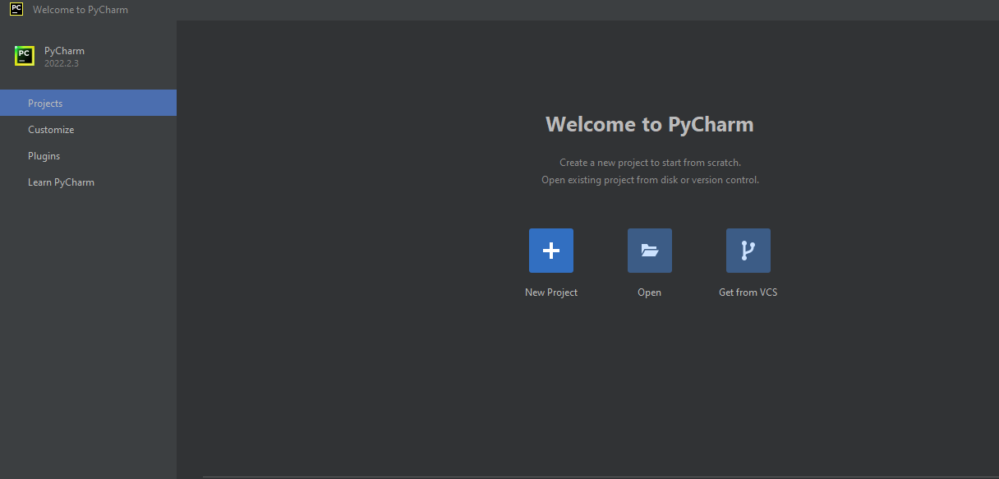

# PROSES / LANGKAH - LANGKAH PRAKTIKUM
## Latihan 1

### - Menjalankan Python Console
#### - Menampilkan tulisan "Hello" dilayar
#### - Menampilkan tulisan "Saya sedang belajar python" dilayar

## Latihan 2

### - Menjalankan dua buah bilangan menggunakan variabel a dan b.
#### - Mendefinisikan variabel a dengan nilai 11
#### - Mendefinisikan variabel b dengan nilai 12
#### - Mencetak nilai variabel a dan b
#### - Mencetak hasil penjumlahan a+b

## Latihan 3

### - Menjalankan IDLE
#### - Membuat file baru dengan nama latihan3.py (pastikan lokasi file pada folder lab2py pada direktori kerja anda)
#### - Menggunakan fungsi input untuk mengambil nilai variabel dari keyboard.

## Langkah - Langkah Menggunakan PyCharm

#### - Jika belum terinstal, silahkan download di https://www.jetbrains.com/pycharm/
#### - Setelah selesai instalisasi, buka PyCharm
#### - Membuat laman kerja baru dengan menekan (+) atau Create New Project

## Virtual Environment

## Menambahkan File baru

## Menjalankan Progam

